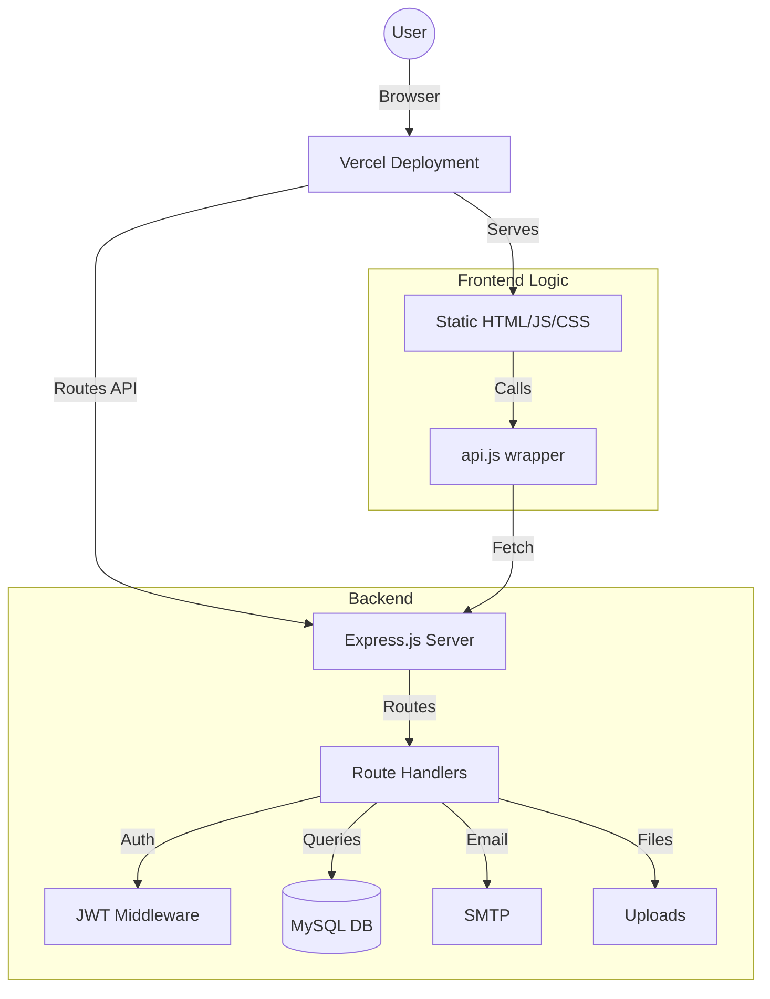

# TAKE ONE Nexus - Tech Stack & Architecture Reference

This document provides a comprehensive overview of the TAKE ONE Nexus project's technical architecture, dependencies, and deployment setup. It is intended for AI coding agents and developers to quickly understand the codebase.

## Project Summary
TAKE ONE is a professional collaboration platform for film crews and scriptwriters. It facilitates project discovery, script sharing, and collaboration requests within the film industry.

---

## Tech Stack

### Core Technologies
- **Frontend**: Vanilla HTML5, CSS3, JavaScript (ES6+).
- **Backend**: [Node.js](https://nodejs.org/) with [Express.js](https://expressjs.com/).
- **Database**: [MySQL](https://www.mysql.com/) (using `mysql2/promise` for async pooling).
- **Authentication**: JWT (JSON Web Tokens) with `bcryptjs` for secure password hashing.
- **Deployment**: [Vercel](https://vercel.com/) (configured via `vercel.json` with `@vercel/node`).

### Key Third-Party Packages
- `jsonwebtoken`: Secure user sessions.
- `bcryptjs`: Password hashing.
- `mysql2`: Database connectivity.
- `nodemailer`: System emails and notifications.
- `multer`: Handling file uploads (avatars, posters).
- `cors`: Cross-Origin Resource Sharing.
- `dotenv`: Environment variable management.

---

## Architecture Overview

The project follows a **Modular Monolith** architecture with a clear separation between frontend assets and backend API logic.

### Mermaid Diagram

---

## Key Folders and Files

| Path | Responsibility |
| :--- | :--- |
| `server.js` | Main entry point, Express app initialization, and static file routing. |
| `api.js` | Client-side API wrapper using `fetch` and `localStorage` for JWT. |
| `routes/` | Modular Express routers (users, scripts, requests, etc.). |
| `middleware/` | Custom middleware for Authentication and Moderation. |
| `database/` | SQL schema (`schema.sql`), seeding (`seed.sql`), and init scripts. |
| `config/` | System configurations, specifically `db.js` for MySQL pooling. |
| `utils/` | Reusable utility functions (emailing, formatting). |
| `uploads/` | Local storage for user-uploaded media. |
| `vercel.json` | Deployment configuration for Vercel. |

---

## Backend/API Structure

All API endpoints are prefixed with `/api/`.

- **Users**: `/api/users` (Registration, Login, Profile management)
- **Scripts**: `/api/scripts` (Search, Create, Manage film scripts)
- **Requests**: `/api/requests` (Collaboration requests between users)
- **System**: `/api/system` (Health checks, email status)
- **Moderation**: `/api/moderation` (Report handling)

---

## Database and Schema Notes
The database uses a relational schema with the following core tables:
- `users`: Stores user credentials, roles, and profiles.
- `scripts`: Stores project details and ownership.
- `collaboration_requests`: Manages the state of collaboration between users and scripts.

**Connection Method**: A MySQL connection pool is managed in `config/db.js` with a 10-second timeout optimized for Vercel.

---

## Auth and Session Flow
1. **Login**: User submits credentials to `/api/users/login`.
2. **Token**: Server validates and returns a JWT.
3. **Storage**: Frontend (`api.js`) saves the token in `localStorage`.
4. **Requests**: Subsequent requests include the token in the `Authorization: Bearer <token>` header.
5. **Verification**: `middleware/auth.js` verifies the token on protected routes.

---

## Environment Variables
Create a `.env` file based on `.env.example`:

- `DB_HOST`, `DB_PORT`, `DB_NAME`, `DB_USER`, `DB_PASSWORD`
- `JWT_SECRET`: Random string for signing tokens.
- `SMTP_HOST`, `SMTP_PORT`, `SMTP_USER`, `SMTP_PASS`: For email notifications.
- `MODERATOR_EMAILS`: Comma-separated list for admin access.

---

## Local Development Commands
- **Install**: `npm install`
- **Start**: `npm start`
- **Dev Mode**: `npm run dev` (starts `nodemon` with watchers on routes and config).

---

## Deployment Notes
- **Platform**: Vercel.
- **Runtime**: Node.js.
- **Entry**: `server.js` handles both static serving and API routing.
- **Database**: Requires an external MySQL host (e.g., Aiven, PlanetScale, or a VPS) as Vercel does not host databases.

---

## Known Production Issues
- **Database 500 Errors**: Some production routes may return 500 errors. This is often related to database connection pooling or firewall settings on Vercel. 
  - *Recommendation*: Check Vercel environment variables and MySQL database schema/uptime. Ensure `connectTimeout` is sufficient.

---

## Agent Handoff Notes
- This project is a **hybrid** of a classic Express app and a static site.
- The frontend is located in the root directory (`*.htm`, `*.js`, `*.css`).
- Use `api.js` when modifying frontend logic to ensure consistency in how API calls are made.
- Always check `config/db.js` if database issues arise, especially regarding connection limits.
