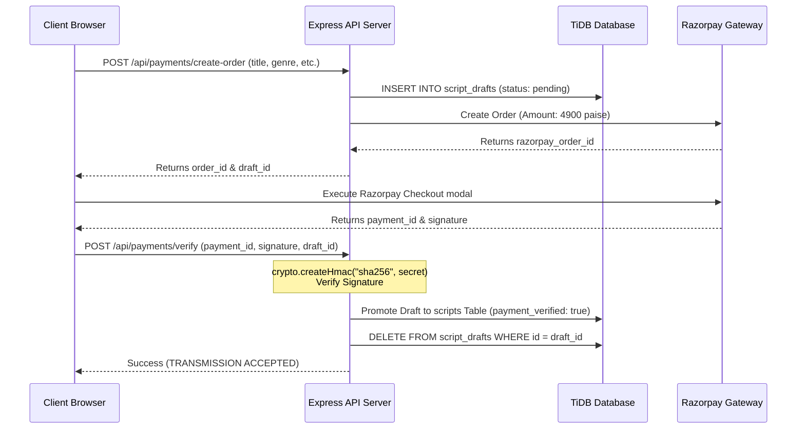

# 💳 TAKE ONE Nexus — Payment System

To maintain quality and prevent listing abuse, uploading a public screenplay on TAKE ONE Nexus requires a verification fee of ₹49 processed securely through Razorpay. This document outlines the transaction lifecycle.

---

## 1. Transaction Flow Architecture

To ensure payment integrity, the platform never trusts client-side success events. A script record is only created after a cryptographically verified signature confirmation on the backend.



---

## 2. API Endpoints

All payment endpoints are protected by `paymentLimiter` (10 requests per 15 minutes) and validate schema inputs before execution.

### A. Create Order
- **Endpoint**: `POST /api/payments/create-order`
- **Auth**: Authenticated User
- **Request Body**:
  ```json
  {
    "title": "My Film Script",
    "genre": "Sci-Fi",
    "synopsis": "A tale of digital agents..."
  }
  ```
- **Actions**:
  1. Inserts fields into `script_drafts` table.
  2. Creates a Razorpay order.
  3. Registers a pending payment record in `script_upload_payments`.

### B. Verify Payment
- **Endpoint**: `POST /api/payments/verify`
- **Auth**: Authenticated User
- **Request Body**:
  ```json
  {
    "razorpay_order_id": "order_xyz123",
    "razorpay_payment_id": "pay_abc789",
    "razorpay_signature": "hmac_signature_here",
    "draft_id": 42
  }
  ```
- **Actions**:
  1. Compares the signature using:
     ```javascript
     const generated = crypto
       .createHmac('sha256', process.env.RAZORPAY_KEY_SECRET)
       .update(order_id + '|' + payment_id)
       .digest('hex');
     ```
  2. If matching, inserts the screenplay details into `scripts` with `payment_verified = true`.
  3. Deletes the draft record.

---

## 3. Webhook Handling

To prevent script loss if a user closes the browser during verification:
- Razorpay Webhooks are received on `/api/payments/webhook`.
- Signature is verified using the Webhook Secret.
- If verified, the draft is promoted to the main list asynchronously.
- Webhook endpoints bypass the CSRF protection middleware because they are server-to-server and rely on cryptographic signature validation.
